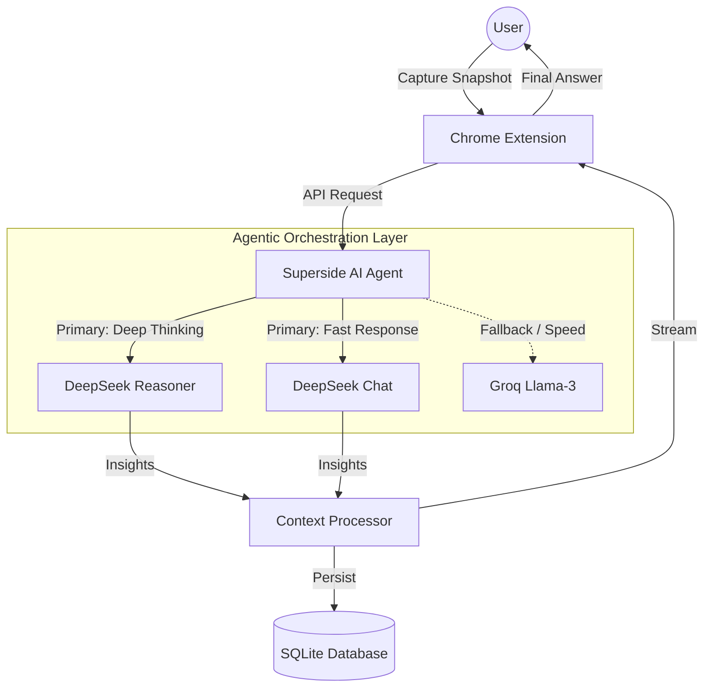
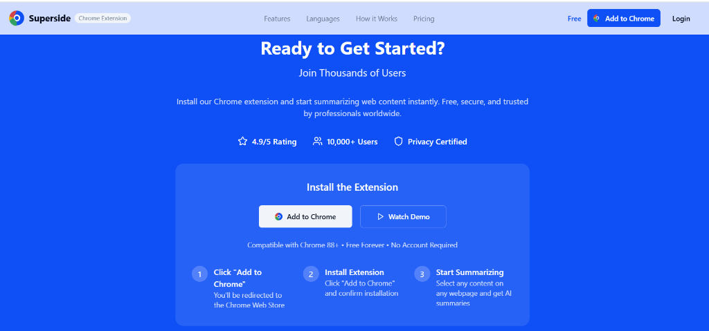

# <p align="center">🚀 Superside: Smart Summaries In Seconds</p>

<p align="center">
  
  
  
  
</p>

---

**Superside** is an advanced **AI Agent** designed to revolutionize how you consume web content. Capture any area of a webpage and have an agent analyze, reason, and provide answers instantly in over 16 languages.


<p align="center">
  
</p>

## ✨ Key Features

- **📸 Smart Snap Tool**: Select any area of a webpage—perfect for quizzes, articles, and complex visual content.
- **🧠 AI Detection**: Automatically identifies quiz questions and Q&A content, providing instant answers with detailed explanations.
- **🌍 Multilingual Power**: Advanced support for 16+ languages, including English, Tamil, Hindi, Malayalam, Telugu, Kannada, Spanish, French, German, Arabic, Chinese, Japanese, and more.
- **⚡ Lightning Fast**: Get comprehensive summaries in under 3 seconds.
- **🛡️ Privacy First**: Secure processing with a focus on data protection.
- **💬 Interactive AI Chat**: Dive deeper into any topic by starting a conversation with our integrated AI models.

## 🏗️ Agent Architecture

Superside operates as a sophisticated AI Agentic system, orchestrating multiple models to deliver the highest quality of reasoning.



## 🛠️ Integrated LLMs

Superside leverages the efficiency of industry-leading AI models:
- **Groq** & **DeepSeek** (Optimized for speed and reasoning)
- **ChatGPT**, **Gemini**, **Claude**

## 🚀 How It Works

1.  **Add to Chrome**: Install the extension from the Chrome Web Store.
2.  **Select & Capture**: Use the intuitive snap tool to select any content on your screen.
3.  **AI Analysis**: Our models process the visual and textual content instantly.
4.  **Learn & Grow**: Receive clear, concise summaries and actionable insights.

---

## 💻 Tech Stack

- **Frontend**: React, TypeScript, Vite
- **UI Components**: shadcn/ui, Radix UI, Lucide Icons
- **Styling**: Tailwind CSS, Framer Motion
- **State Management**: TanStack Query (React Query)
- **Routing**: React Router DOM

---

## 🛠️ Local Development

To get started with the project locally:

1.  **Clone the repository**:
    ```sh
    git clone https://github.com/kelvinmaina01/Superside.git
    cd Superside
    ```

2.  **Install dependencies**:
    ```sh
    npm install
    ```

3.  **Run the development server**:
    ```sh
    npm run dev
    ```

4.  **Build for production**:
    ```sh
    npm run build
    ```

---

<p align="center">
  
</p>

<p align="center">
  Built with ❤️ by the <b>Superside Team</b>.
</p>
