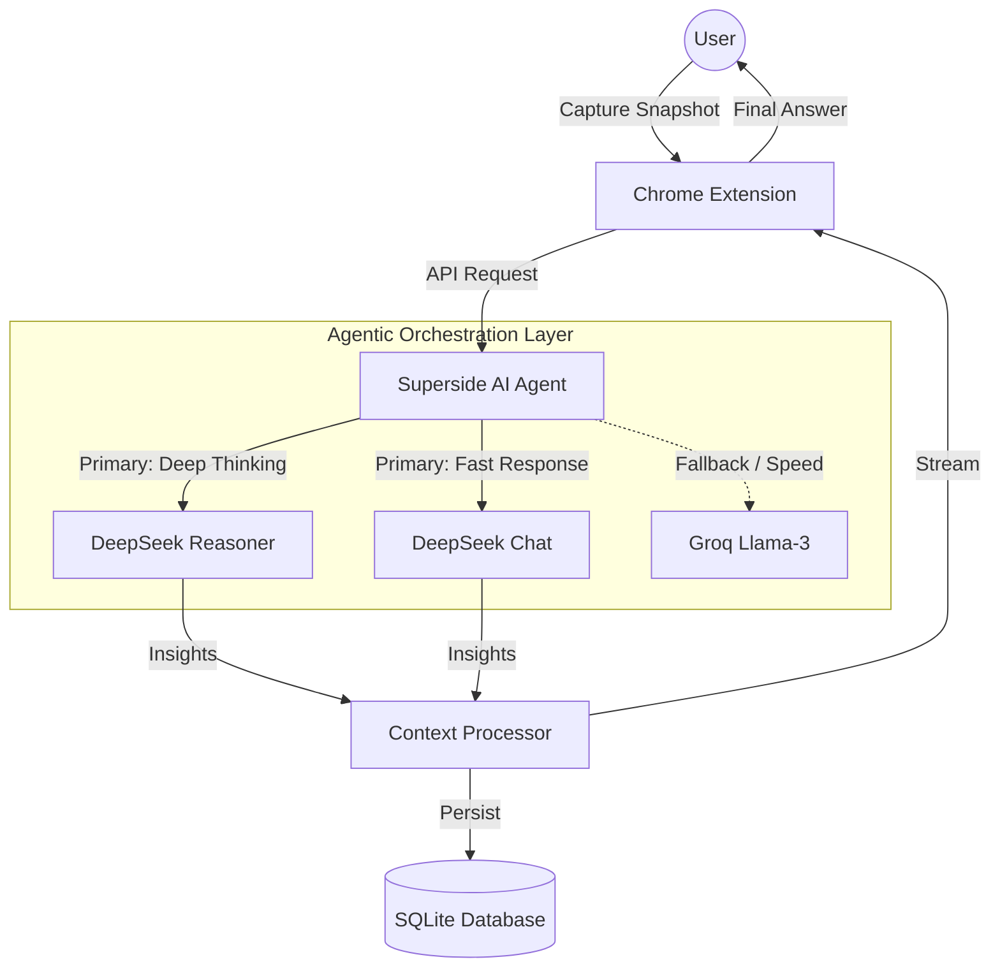

# 
🚀 Superside: AI Agent Screenshot Tool

  
  

**Superside** is an advanced **AI Agent** that lives on your screen. Snap any content, and let the agent reason and provide answers instantly without ever switching tabs.

---

## 🏘️ Project Structure

- **`frontend/`**: React + Vite application (Root directory).
- **`backend/`**: Django REST Framework API.
- **`docs/`**: Detailed project documentation.

---

## 🏗️ Agent Architecture

---

## 📖 Documentation

For detailed setup instructions, AI orchestration logic, and technical specifications, please check our full documentation:

👉 **[View Full Documentation](./docs/DOCUMENTATION.md)**

---

## 🚀 Quick Start

1. **Backend**: `cd backend && python manage.py runserver`
2. **Frontend**: `npm run dev`

---

  Built with ❤️ for the next generation of learners.

