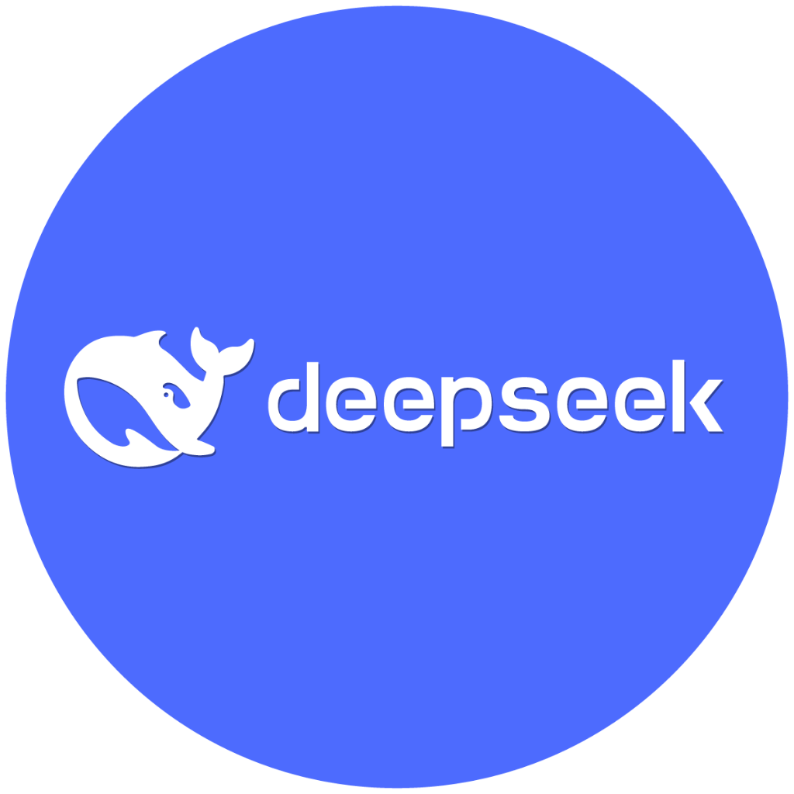
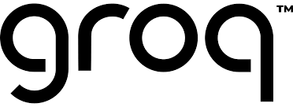
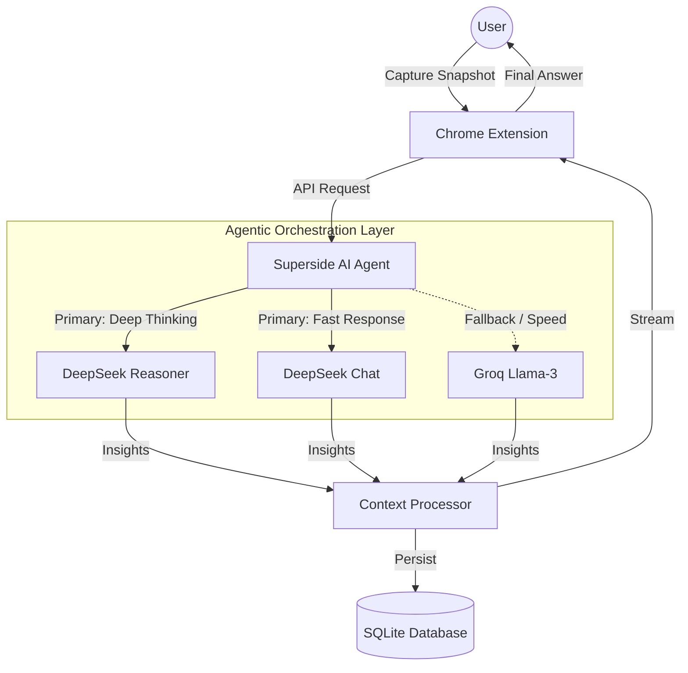

# 
🚀 Superside: Deep Thinking AI Agent

  
  

---

## 🏗️ Agent Architecture

Superside operates as a sophisticated AI Agentic system, orchestrating multiple models to deliver the highest quality of reasoning.

## 🧠 AI Orchestration Logic

- **⚡ DeepSeek Fast Mode**: Powered by `deepseek-chat` for near-instant contextual summaries.
- **🧠 DeepSeek Thinking Mode**: Powered by `deepseek-reasoner` for complex breakdowns.
- **🏎️ Groq Fallback**: Ensures system reliability if primary models are under load.

## 🛠️ Technical Architecture

### **Frontend**
- React 18 + Vite
- Tailwind CSS (Premium Glassmorphism)
- Shadcn/UI + Framer Motion

### **Backend**
- Django REST Framework
- SQLite Database
- JWT Auth + Stripe Billing
- Custom `AIService` Multi-model Orchestrator

---

## 🚀 Setup & Installation

### **1. Backend**
1. Navigate to `/backend`
2. Configure `.env` from `.env.example`
3. Run `python manage.py migrate`
4. Run `python manage.py runserver`

### **2. Frontend**
1. Run `npm install`
2. Run `npm run dev`

---

## 📅 Roadmap
- [x] Multi-model Agent Orchestration
- [x] User Tiers & Billing Integration
- [ ] Chrome Web Store Submission
- [ ] Viral Launch (Mid-Feb 2026)
